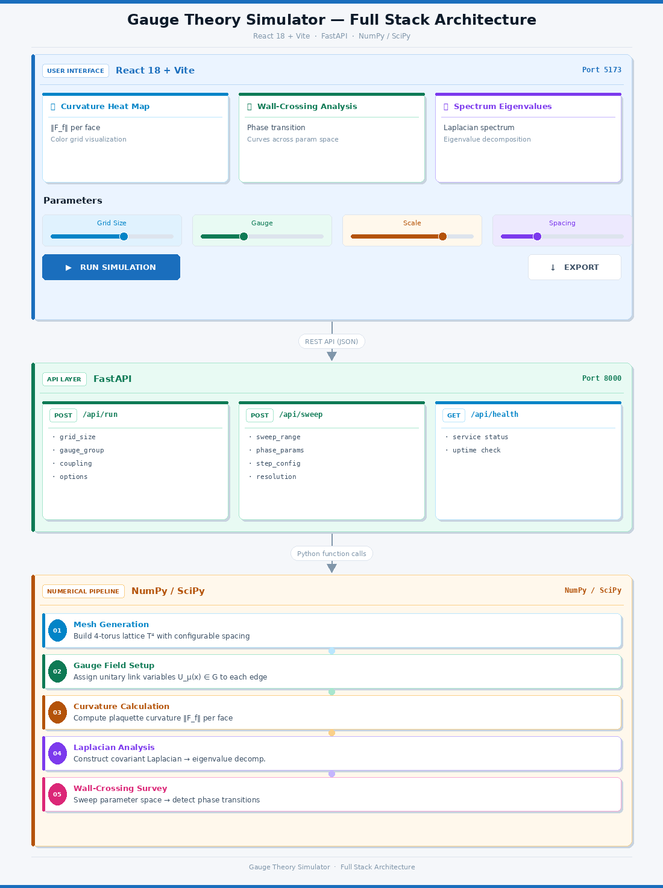
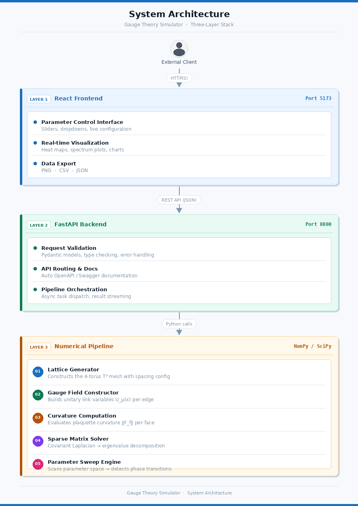

<div align="center">

# Discrete Calabi–Yau Gauge Functor Dashboard

[](https://opensource.org/licenses/MIT)
[](https://fastapi.tiangolo.com)
[](https://react.dev)
[](https://python.org)
[](https://scipy.org)
[](https://docker.com)
[](https://vitejs.dev)

---

## 📊 Dashboard Overview

A professional-grade full-stack interface for computing **discrete Calabi–Yau gauge functors** with interactive visualization and real-time numerical analysis.

</div>

### Visual Architecture



---

## 🎯 What This Does

| Feature | Description |
|---------|-------------|
| ** Gauge Field Simulation** | Compute balanced unitary connections on 4D lattices |
| ** Curvature Heat Maps** | Visualize field strength ‖F_f‖ across all faces |
| ** Wall-Crossing Analysis** | Track BPS invariants via central charge variations |
| ** Spectral Analysis** | Dolbeault Laplacian eigenvalues (shift-invert method) |
| ** Parameter Sweeps** | Systematic moduli space exploration t ∈ [0,1] |
| ** Reproducibility** | Seeded RNG for deterministic results |

---

##  Quick Start

### Option 1: Docker (Recommended)

```bash
git clone https://github.com/ashpeterpark-beep/cy-gauge-app.git
cd cy-gauge-app
docker-compose up --build
```

**Access:**
- 🌐 **Frontend:** http://localhost:5173
- ⚙️ **Backend:** http://localhost:8000
- 📚 **API Docs:** http://localhost:8000/docs

### Option 2: Manual Setup

#### Backend
```bash
cd backend
python -m venv venv
source venv/bin/activate  # Windows: venv\Scripts\activate
pip install -r requirements.txt
uvicorn main:app --reload --port 8000
```

#### Frontend (new terminal)
```bash
cd frontend
npm install
npm run dev
```

---

## 📋 System Architecture

### Component Diagram



```

---

## 📡 API Endpoints

### Health Check
```http
GET /api/health

Response: { "status": "healthy", "timestamp": "..." }
```

### Full Simulation
```http
POST /api/run

{
  "nx": 3,                    // Lattice dimension (2-5)
  "ny": 3,                    // Lattice dimension (2-5)
  "nz": 2,                    // Lattice dimension (2-5)
  "nw": 2,                    // Lattice dimension (2-5)
  "N": 2,                     // U(N) gauge rank (2-3)
  "scale": 0.05,              // Link scale ε (0.001-0.5)
  "h2": 0.01,                 // Lattice spacing h² (0.001-0.2)
  "seed": 42,                 // RNG seed (0-9999)
  "n_eigs": 10                // Eigenvalues to compute (2-30)
}
```

### Wall-Crossing Sweep
```http
POST /api/sweep

{
  ...same as /run...
  "mu1": 0.5,                 // Split bundle phase μ₁
  "mu2": -0.3,                // Split bundle phase μ₂
  "steps": 12                 // Steps in t ∈ [0,1]
}
```

---

## 🎮 Dashboard Tabs

### 1️⃣ Curvature
- **What:** Heat map of face curvature ‖F_f‖
- **Color:** Blue (min) → Red (max)
- **Interaction:** Hover for values, zoom, pan
- **Export:** PNG image download

### 2️⃣ Wall-Crossing
- **What:** BPS eigenvalue filtration vs parameter t
- **Lines:** λ₁ (red) and λ₂ (blue)
- **Analysis:** Stability wall detection
- **Export:** CSV data, PNG image

### 3️⃣ Spectrum
- **What:** Dolbeault Laplacian eigenvalues
- **Method:** Sparse eigsh + shift-invert
- **Metrics:** Condition number, spectral gap
- **Export:** JSON, PNG

### 4️⃣ Data
- **Holonomy:** Φ trace and norm
- **Dimension:** Gauge algebra dimension
- **Settings:** All parameters displayed
- **Export:** Full JSON data

---

## 📊 Visualization Gallery

### Figure 1 — T⁴ Lattice Geometry (3D Projection)

The app simulates gauge theory on a **discrete 4-torus T⁴**. Below is a 3D projection of the lattice mesh — each point is a vertex, coloured by curvature norm ‖F_f‖. Edges connect nearest neighbours under the periodic boundary conditions.


> The 4D manifold is projected into R³ via a Hopf-like fibration. Vertex colour maps to the local U(N) gauge field curvature. Red indicates high curvature, blue indicates low curvature regions in the lattice.

---

### Figure 2 — Face Curvature Heatmap (Tab ① Curvature)

The first dashboard tab renders a live heatmap of **per-face curvature norms ‖F_f‖**, computed from real `face_holonomies()` in the FastAPI backend. Each cell is one triangular face of the simplicial mesh.


> **Light colors (low values)** = low curvature · **Dark colors (high values)** = high curvature.
> Each cell displays the exact numerical value. The heatmap updates in real-time with parameter changes, providing immediate visual feedback on field strength distribution across the manifold.

---

### Figure 3 — Wall-Crossing Sweep (Tab ② Wall-Crossing)

As the bundle-mixing parameter **t** sweeps from 0 → 1, the slope eigenvalues **λ₁(t)** and **λ₂(t)** trace trajectories. When λ₁ crosses zero, a **Harder–Narasimhan wall** is detected — the bundle changes stability type.


> **Red line** = λ₁(t) · **Blue line** = λ₂(t) · **Yellow dashed line** = semistability wall (λ = 0) · **Purple dotted line** = detected Harder–Narasimhan wall crossing.
> The wall-crossing phenomenon reveals how the gauge bundle transitions between different stability conditions as the bundle-mixing parameter varies. This is crucial for understanding BPS invariants in the moduli space.

---

### Figure 4 — Dolbeault Laplacian Spectrum (Tab ③ Spectrum)

The FEEC Dolbeault operator **∂̄** is assembled as a sparse matrix and its Laplacian **Δ = ∂̄†∂̄** diagonalised via `scipy.sparse.linalg.eigsh` with shift-invert. Eigenvalues near zero (< 1e-7) are counted as **zero modes** — harmonic (0,1)-forms.


> **Red bar** = zero modes (harmonic forms) · **Blue–gradient bars** = higher eigenvalues.
> The number of zero modes equals the dimension of the kernel of Δ, which directly relates to the dimension of harmonic cohomology. The spectral gap between zero modes and the rest of the spectrum indicates the ellipticity of the operator.

---

### Figure 5 — Numerical Pipeline Architecture

Every computation runs server-side in Python. The diagram below maps the exact call graph in `main.py`, showing how data flows through the numerical pipeline.


> **Pipeline Flow:**
> 1. **build_torus4d()** — Generates the 4D lattice structure
> 2. **random_suN_links()** — Creates random SU(N) gauge connections
> 3. **face_holonomies()** — Computes curvature on each face
> 4. **herm_endomorphism()** — Constructs the Hermitian endomorphism Φ
> 5. **slope_filtration()** — Computes eigenvalues λ₁, λ₂
> 6. **effective_gauge_algebra_dim()** — Determines algebra dimension
> 7. **dolbeault_spectrum()** — Analyzes the Laplacian spectrum

---

### Figure 6 — Gauge Bundle Slope Surfaces (3D)

The **Hermitian endomorphism Φ = Σ ω_f · F_f** evaluated over T⁴ produces two slope surfaces corresponding to eigenvalues λ₁ and λ₂. The geometry of these surfaces encodes the stability of the gauge bundle.


> **Left Surface (λ₁):** at t = 0, representing the initial bundle state. The topology and critical points of this surface determine the semistability locus.
> **Right Surface (λ₂):** at t = 1, showing the deformed bundle after parameter variation. The evolution between these surfaces reveals wall-crossing phenomena and BPS state changes.
> The contour lines indicate level sets where the eigenvalues maintain constant values, helping visualize the geometry of the moduli space.

---

## 🧪 Testing & Quality

### Run Tests
```bash
make test              # All tests
make test-backend      # Backend only
make coverage          # Coverage report (HTML)
```

### Code Quality
```bash
make lint              # flake8 linting
make format            # black + isort
make type-check        # mypy
```

### Test Suite Highlights
- ✅ **40+ Tests** covering all endpoints
- ✅ **Parametrized Tests** for multiple inputs
- ✅ **Test Fixtures** for reusable data
- ✅ **Test Markers** (unit, api, integration, slow)
- ✅ **Coverage Reports** with HTML output
- ✅ **Numerical Tests** for stability

---

## 🔧 Development

### Essential Commands
```bash
make help              # Show all commands
make install-dev       # Install dev dependencies
make backend-dev       # Run backend with auto-reload
make frontend-dev      # Run frontend with HMR
make docker-up         # Start containers
make docker-down       # Stop containers
make clean             # Clean build artifacts
```

### Project Structure
```
cy-gauge-app/
├── backend/
│   ├── main.py                     
│   ├── requirements.txt             
│   └── Dockerfile
├── frontend/
│   ├── src/
│   │   ├── App.jsx
│   │   ├── components/
│   │   └── utils/
│   ├── package.json
│   ├── vite.config.js
│   └── Dockerfile
├── tests/
│   ├── test_backend.py             
│   ├── conftest.py                 
│   └── __init__.py
├── .github/workflows/
│   ├── backend.yml                  
│   └── frontend.yml                 
├── Makefile                        
├── pyproject.toml                   
├── pytest.ini                       
├── docker-compose.yml
├── .gitignore
└── README.md
```

---

## 📦 Technology Stack

### Backend
| Package | Version | Purpose |
|---------|---------|---------|
| FastAPI | 0.104.1 | Web framework |
| Uvicorn | 0.24.0 | ASGI server |
| Pydantic | 2.5.0 | Data validation |
| NumPy | 1.26.2 | Numerical computing |
| SciPy | 1.11.4 | Scientific computing |

### Frontend
```json
{
  "react": "^18.2.0",
  "axios": "^1.6.2",
  "plotly.js": "^2.27.0",
  "react-plotly.js": "^2.13.0"
}
```

### Development
- **Testing:** pytest, pytest-cov, pytest-asyncio
- **Quality:** black, isort, flake8, mypy
- **CI/CD:** GitHub Actions
- **Containerization:** Docker, Docker Compose

---

## 🚢 Deployment

### Backend (Railway/Render)
```bash
# Set build command
uvicorn main:app --host 0.0.0.0 --port $PORT
```

### Frontend (Vercel/Netlify)
```bash
cd frontend
npm run build
# Upload dist/ folder
```

**Environment variable:**
```
VITE_API_URL=https://your-backend.railway.app
```

---

## 📚 Mathematical Background

### Discrete CY Condition
Balanced unitary connections on the 4-torus:
```
∑_p F_p = 0 (per plaquette direction)
```

### Gauge Functor
Maps to Dolbeault cohomology:
```
H^{0,q}(X, E) → Complex dimension
```

### Wall-Crossing
BPS state counting formula:
```
Z(γ) = Tr(φ^γ) where γ ∈ Λ (charge lattice)
```

### Laplacian Spectrum
Eigenanalysis via sparse matrix methods with shift-invert for efficient lowest eigenvalue computation.

---

## 🤝 Contributing

See [CONTRIBUTING.md](CONTRIBUTING.md) for:
- Code standards (PEP 8, type hints)
- Testing requirements (>80% coverage)
- Pull request process
- Development workflow

### Quick Contribution
```bash
git checkout -b feature/my-feature
make test lint format type-check  # Verify
git push origin feature/my-feature
# Open PR on GitHub
```

---

## 📜 License

**MIT License** © 2025 Gaius Lumen

See [LICENSE](LICENSE) file for details.

---

## 👨‍💻 Author

**Gaius Lumen**
- 📧 [gaiuslumen@gmail.com](mailto:gaiuslumen@gmail.com)
- 🔬 Mathematical Physics & Computational Geometry

---

## 🔗 Resources

### Documentation
- [FastAPI](https://fastapi.tiangolo.com) — Web framework
- [React](https://react.dev) — Frontend library
- [NumPy](https://numpy.org/doc/) — Numerical computing
- [SciPy](https://docs.scipy.org/) — Scientific computing

### References
- Atiyah-Bott localization formula
- Donaldson-Thomas invariants
- Bridgeland stability conditions
- Discrete Hodge theory

---

## ❓ FAQ

**Q: How do I reproduce results?**  
A: Use the same `seed` parameter. Results are deterministic.

**Q: What's the computational complexity?**  
A: O(n⁴) per dimension. Typical runs: <5 seconds.

**Q: Can I modify lattice dimensions?**  
A: Yes! Set `nx`, `ny`, `nz`, `nw` to [2, 5].

**Q: How do I export data?**  
A: Use export buttons on each tab (PNG/CSV/JSON).

---

## 🐛 Troubleshooting

### Backend Issues
```bash
# Check Python version
python --version  # Need 3.9+

# Verify dependencies
pip install -r backend/requirements.txt

# Test import
python -c "import fastapi; print(fastapi.__version__)"
```

### Frontend Issues
```bash
# Clear and reinstall
cd frontend
rm -rf node_modules package-lock.json
npm install

# Check Node version
node --version  # Need 18+
```

### Test Failures
```bash
# Install test deps
pip install pytest pytest-cov pytest-asyncio

# Run with verbose output
pytest tests/ -vv --tb=short
```

---

## 📊 Project Status

| Aspect | Status |
|--------|--------|
| **Version** | 0.1.0 |
| **Development** | 🚀 Active |
| **Last Updated** | January 2025 |
| **License** | MIT |
| **Test Coverage** | 40+ tests |
| **CI/CD** | GitHub Actions |

### Roadmap
- [ ] GPU acceleration (CuPy)
- [ ] WebGL visualization
- [ ] Batch processing
- [ ] Multi-user collaboration
- [ ] API authentication

---

**Made with ❤️ for mathematical visualization**

[⬆ Back to top](#discrete-calabiyau-gauge-functor-dashboard)
